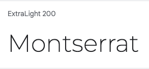
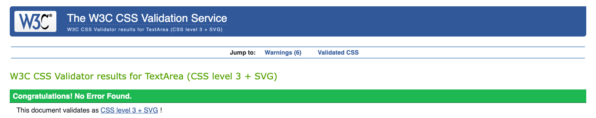
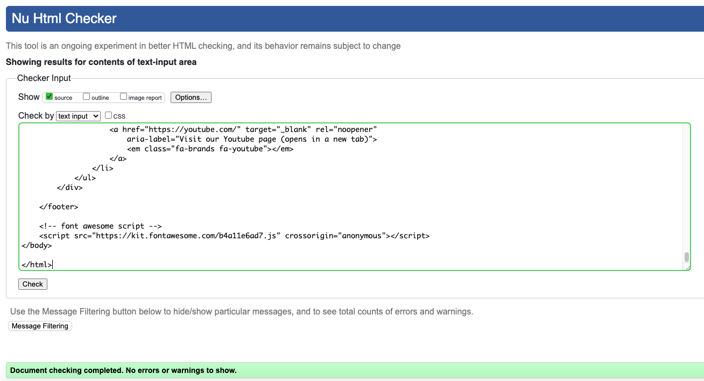
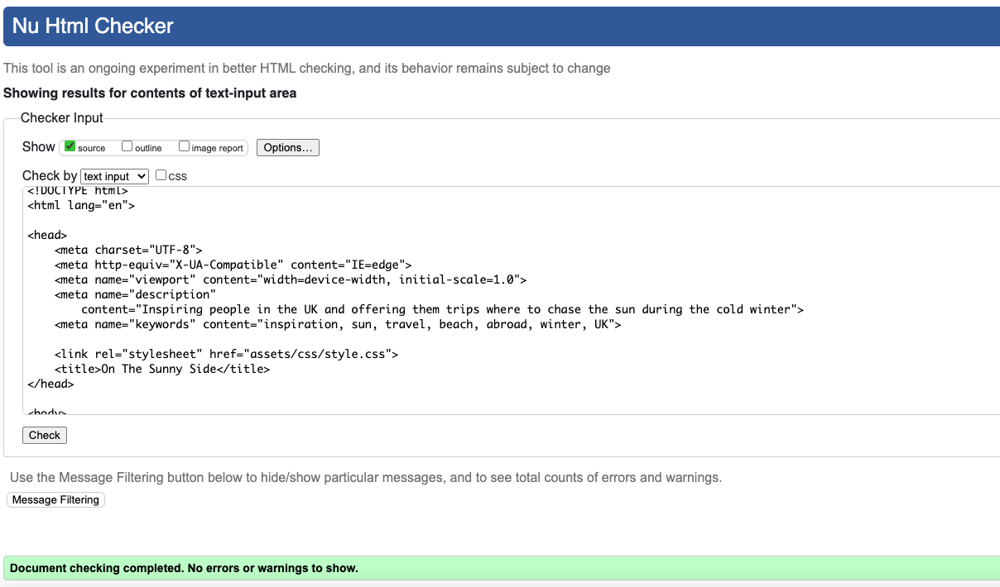
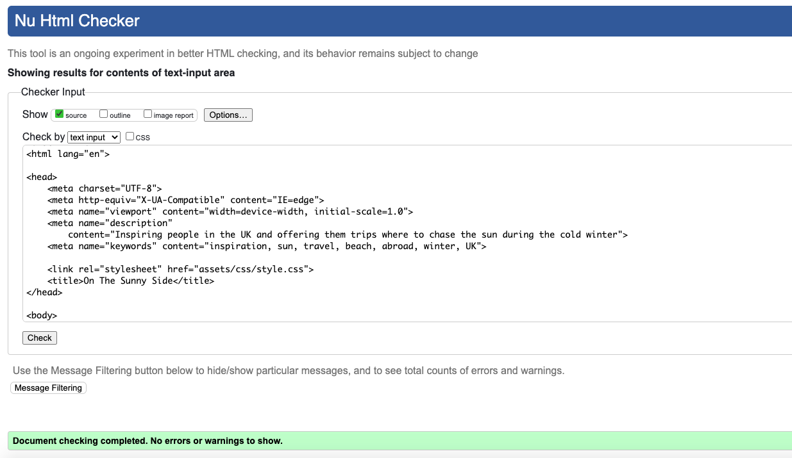

# On The Sunny Side

This website is for all users who are planning to take some winter holidays, in a sunny destination, while the weather is cold. The website is colorful and motivating, offering to inspire its users to check out 3 different destinations and learn about them and their climate. The users can than submit an enquire form to ask for a quote. 

The On The Sunny Side website is designed to give potential customers inspiration and informative details and pictures about the sunny holiday destinations where it is offering tours during the cold winter months. This means the site needs to be responsive, allowing visiters to view on any device without quality of experience suffering. The main focus of the site is to be engaging, colourful, motivating while providing useful information about the featured destination's climate. The customers can also submit an enquire form to ask for a quote for their dream holiday. 

[Link to my website](https://lilla-kavecsanszki.github.io/On-The-Sunny-Side/)

'space for the responsive screenshot'

The business goals of this website are:
- Provide high quality examples of the destinations through their galleries and descriptions.
- Drive sales in the form of first contact (through the Enquire Now page) that will then lead to a sales call with a 
  travel agent.
- Excellent UX to keep potential clients on site long enough to fill out the enquiry form, even with a sticky navigation 
  bar for easier and hussle-free navigation throughout the website.

The customer goals of this website are:
- Searching for high quality, bespoke tours in sunny countried during winter times
- Easy to edit and\or add any specific stops, excursions to their package (with the Wishlist text box on the Enquiry form)
- Personalised prices based on personal needs and budgets. 

# User Experience (UX)

### Ideal client

The ideal client for this business is:

- English speaking.
- Has disposable income.
- Likes to travel abroad.
- Primarily people who lives in the UK (but can be anywhere in the world).
- Individual, Couples, Families or Groups

Visitors to this website are searching for:

- An experienced travel agency to create a personalised trip for their ultimate holiday experience.

This website is the best way to help them achieve these things because:

- Most tours at other agencies are limited in terms of their packages and availabilities. 
- On different travel agnecy websites it is difficult to choose between their options while people can prefer some  
  features from option A but some from any other options too. They however wouldn't have the opportunity to combine those.

This website is:

- Easy to navigate due to its sticky navbar that scrolls with the user on every pages.
- Social media sites in footer, open up in new tabs in order to not to distract the customers away from the website.
- Gives the customers options and access to useful and learnable information.
- Gives the customers the information they need without overloading them or distract them from their original ideas
  or wishes.
- Guiding them and their curiosity to the goal of the website - to fill out the enquiry form and so start a conversation.
- The submit button on the enquiry form flags all information boxes that the customer might forgot to fill out before they 
  can send their full enquiry. 

# Accessibility

Accessibility has been a very important point for me while designing website.

I tested all pages of my site using [WAVE](https://wave.webaim.org) and have no errors on any page.
Lighthouse testing for desktop and mobile have scored 100% for accessibility on both.

I used [A11y](https://color.a11y.com) the Color Contrast Accessibility Validator which determined that no colour contrast issues were found on any of the pages.

# Design

### Colour Scheme

- #353838
- #4d4044
- peachpuff

### Typography

I used [Google Fonts](https://fonts.google.com/) to import the following fonts to the site.

The primary font used for headings and the navigation menu is Poiret One, this was chosen as it's easily readible, stylish with a little fun and aims to give the idea of a modern and clean designs. 

The secondary font used for the body is Montserrat which was selected for its clear readibility, that yet works well with Poiret One to maintain an elegant outcome.

# Languages Used

HTML, and CSS were used to complete this project.

# Technologies Used

- [Font Awesome](https://fontawesome.com/) was used for all icons on the pages
- Github was used to store all files for this website
- Gitpod was used to create and edit all original code
- Google Chrome Developer Tools was used for debugging and testing with Lighthouse
- [Google Fonts](https://fonts.google.com/) was used to import both fonts for use on the site

# Features

The On The Sunny Side website includes five main pages, Home, Destinations - Morocco, Destinations - Barbados, Destinations - Dubai and Enquire Now. All the pages are all accessible through the navigation menu shown at the top of the screen. This navigation menu also contains a Contact button next to the Home button that takes the customer to the bottom of the page, on every page, to reveale the contact information of the business. The navigation bar contains a logo as well, on the left side that will take the customer back to the Home page in every case. 

The pages include:

A navigation bar that allows the customers to navigate to each of the main pages of the site. The navigation bar is fixed so it will follow the customer scrolling down the pages, giving them easier access to navigate again. It is also slightly seethrough to make the tab stand out and give an elegant touch to its design.
The page the viewer is currently on is displayed with a different background colour and an over and underline as well to show which page is active. Upon hovering over each of the navigation menu links they'll also be changing their backgrounds and will be over and underlined to show the viewer where they are clicking. 
The navigation bar is responsive meaning that it decreases in size, as well as the menu section will also appear underneath the logo if viewed on smaller screen sizes. This is to streamline the appearance of the navigation bar and reduce clutter on tablet and mobile screens.

A footer is displayed at the bottom of each page which displays the contact information of the business, Copyright information with a disclaimer and social media links to Twitter, Facebook, Instagram and Youtube for the viewers to be able to be get in contact with the business on more platforms.

# Deployment

The On The Sunny Side website is deployed using Github Pages, this was done by:

1. Login to Github
2. Navigate to the account Lilla-Kavecsanszki, and locate the On-The-Sunny-Side repository
3. In On-The-Sunny-Side repository click on the Settings tab
4. In the Code and Automation subheading in the sidebar click on Pages
5. Under Build and Deployment find the Source section, set the source to deploy from a branch, and set this branch to  
   main, and the folder option to /root
6. Click save, wait a few minutes and On The Sunny Side webssite is now deployed at the URL displayed

# Local Deployment

## How to Clone

Locate the main page of On-The-Sunny-Side repository, click the Code button to the left of the green Gitpod button, then choose Local.
Copy the URL of the repository, you can click on headings for HTTPS, SSH, and Github CLI to find their individual links. Open your own terminal in your editor and change the current working directory to the location of where you want the cloned directory to be. In the terminal type git clone, and then paste the URL you copied from On-The-Sunny-Side repository page. Press enter to complete.

## How to Fork

Locate the main page of On-The-Sunny-Side repository. Click the fork button in the top right of the screen, between the watch, and star buttons.

# Testing

W3C CSS Validator result on the css page

W3C HTML Validator result on the Home page

W3C HTML Validator result on the Morocco Destination page

W3C HTML Validator result on the Bardbados Destination page

W3C HTML Validator result on the Dubai Destination page

W3C HTML Validator result on the Enquire Now page

# Credits

## Content

The text for the Home page was a creative work of Georgina Kavecsanszki. The informative texts, describing the climate of the destination countries was originally taken from Wikipedia then cropped.

## Media

All the photos used in this site were obtained from Pexels.com.

## Code

The dropdown menu CSS code was originally taken from https://www.w3schools.com/Css/css_dropdowns.asp and then edited.

CSS code for carousel that I used for responsiveness of gallery images was originally taken from A Pen by Beata Huszar and then edited. https://codepen.io/beahuszar/pen/yLYppYo 

CCS code for 3D carousel for gallery pictures was originally taken from A Pen by Blue Acorn https://freehtmldesigns.com/css-carousels/ 
https://codepen.io/blueacornfed/pen/qdRddr and then edited.

## Acknowledgements

I received inspiration for this project from my own studies of tourism and my love of travelling. I have also liked the solutions on the website of Africasafari https://www.tourcompass.co.uk/africa.htm and AJ Greaves' project, the Portrait Artist.
Also big thank you for my mentor Elaine Roche who guided me towards final tweaks and gave me heads ups on positioning.

## Disclaimer

This website is for educational use only.

