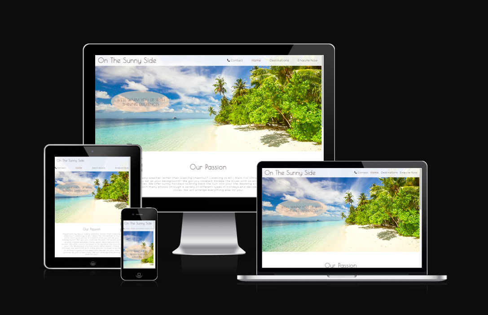
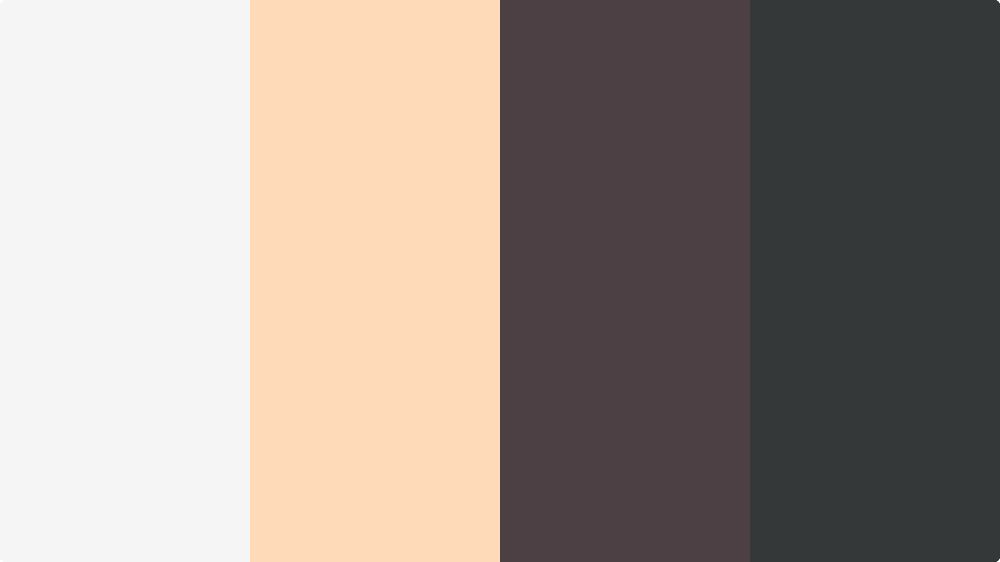
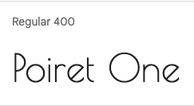
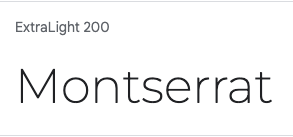
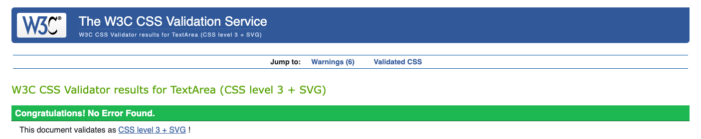
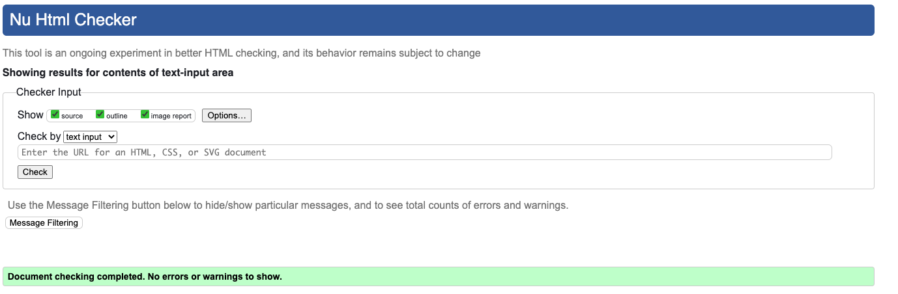
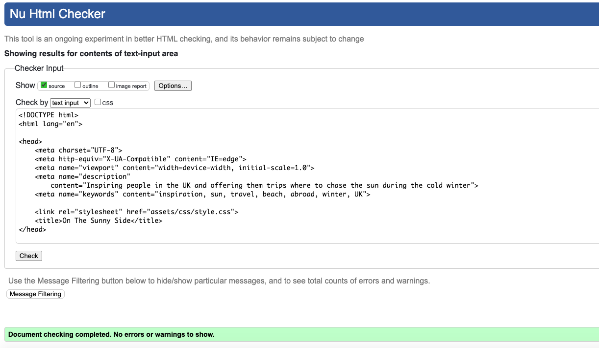
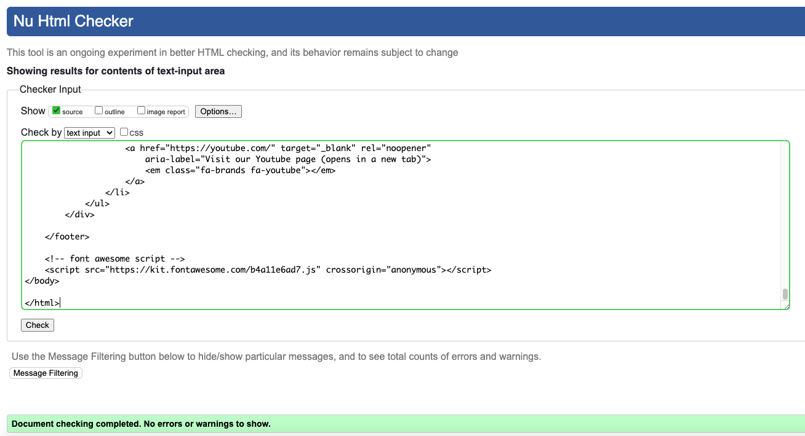
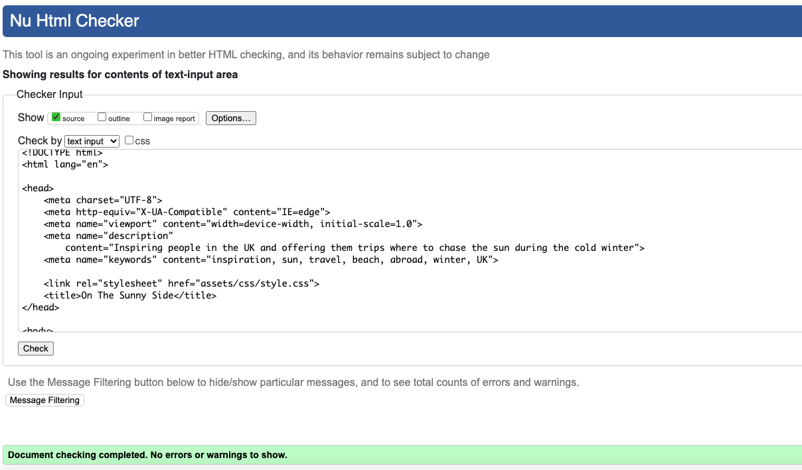
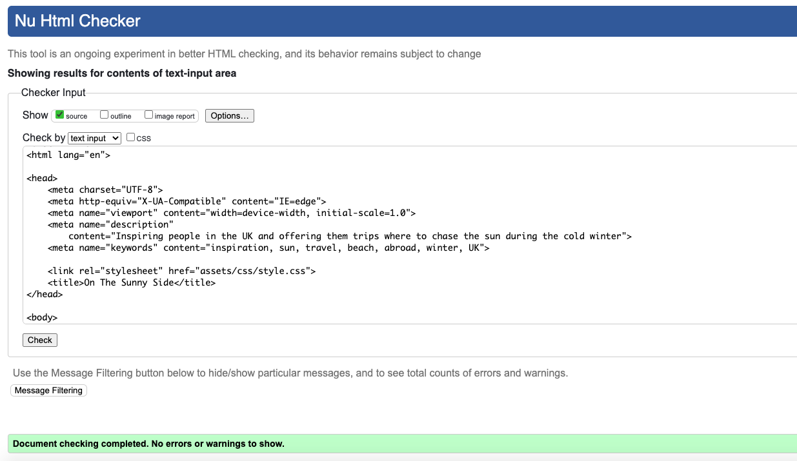

# On The Sunny Side

This website is for all users who are planning to take some winter holidays, in a sunny destination, while the weather is cold. The website is colorful and motivating, offering to inspire its users to check out 3 different destinations and learn about them and their climate. The users can than submit an enquiry form to ask for a quote. 

The On The Sunny Side website is designed to give potential customers inspiration and informative details and pictures about the sunny holiday destinations where it is offering tours during the cold winter months. This means the site needs to be responsive, allowing visitors to view on any sized device without quality of experience suffering. The main focus of the site is to be engaging, colourful, motivating while providing useful information about the featured destination's climate. The customers can also submit an enquiry form to ask for a quote of their dream holiday. 

[Link to my website](https://lilla-kavecsanszki.github.io/On-The-Sunny-Side/)

[I Am Responsive](https://ui.dev/amiresponsive?url=https://lilla-kavecsanszki.github.io/On-The-Sunny-Side/index.html)

The business goals of this website are:
- Provide high quality examples of the destinations through their galleries and descriptions.
- Drive sales in the form of first contact (through the Enquire Now page) that will then lead to a sales call with a 
  travel agent.
- Excellent UX to keep potential clients on site long enough to fill out the enquiry form, even with a sticky navigation 
  bar for easier and hussle-free navigation throughout the website.

The customer goals of this website are:
- Searching for high quality, bespoke tours in sunny countries during winter times
- Easy to edit and\or add any specific stops, excursions to their package (with the Wishlist text box on the Enquiry form)
- Personalised prices based on personal needs and budgets. 

# User Experience (UX)

### Ideal client

The ideal client for this business is:

- English speaking.
- Has disposable income.
- Likes to travel abroad.
- Primarily people who lives in the UK (but can be anywhere in the world).
- Individual, Couples, Families or Groups

Visitors to this website are searching for:

- An experienced travel agency to create a personalised trip for their ultimate holiday experience.

This website is the best way to help them achieve these things because:

- Most tours at other agencies are limited in terms of their packages and availabilities. 
- On different travel agnecy websites it is difficult to choose between their options while people can prefer some features from option A but some from any other options too. They however wouldn't have the opportunity to combine those.

This website is:

- Easy to navigate due to its sticky navbar that scrolls with the user on every pages.
- Social media sites in footer, open up in new tabs in order to not to distract the customers away from the website.
- Gives the customers options and access to useful and learnable information.
- Gives the customers the information they need without overloading them or distract them from their original ideas
  or wishes.
- Guiding them and their curiosity to the goal of the website - to fill out the enquiry form and so start a conversation.
- The submit button on the enquiry form flags all information boxes that the customer might forgot to fill out before they 
  can send their full enquiry. 

User stories

1. As a viewer to the website, I want to easily navigate the site, so I can find what I need efficiently.
2. As a potential new customer to the website, I want to see a gallery that shows what I could do or visit in 
   each destinations if I decide to travel there.
3. As a potential new customer, I want to be able to receive prices for a trip that customed to my preferences, so I can   decide if it is within my budget or to my liking to order.
4. As an interested observer and/or customer, I want to follow the agency on social media, so I can keep up with its latest news, excursions, existing customer stories etc.
5. As a returning visitor to the website, who has already decided to contact the agency, I want to be able to find the request a quote page easily and contact details also for further information.

# Accessibility

Accessibility has been a very important point for me while designing website.

Lighthouse testing for desktop and mobile have scored 100% for accessibility on both.

I used [A11y](https://color.a11y.com) the Color Contrast Accessibility Validator which determined that no colour contrast issues were found on any of the pages.

# Design

### Colour Scheme

- Peachpuff #ffdab9
- Very dark grayish cyan #353838
- Very dark grayish pink #4d4044
- Whitesmoke #f5f5f5, #ffffff

[My Colour Palette](https://colorkit.co/palette/f5f5f5-ffdab9-4d4044-353838/)

I chose these colours apart from efficient contrasting to compliment my photos' blues, greens and purples and their ambiance that they give to the viewer. 

The primary colour is Peachpuff which is a pale orange colour that gives the ambiance of sunny summer day and some could associat with the sand, as well as putting us in a light feel. The purply-brown texts proved great contrast to peachpuff and gave consistency throughout the project.

I also used some white and whitesmoke colours to further elevate the feeling of the website and with decreased opacity here and there increase its elegancy, as well. 

### Typography

I used [Google Fonts](https://fonts.google.com/) to import the following fonts to the site.

The primary font used for headings and the navigation menu is Poiret One, this was chosen as it's easily readible, stylish with a little fun and aims to give the idea of a modern and clean designs. 

The secondary font used for the body is Montserrat which was selected for its clear readibility, that yet works well with Poiret One to maintain an elegant outcome.

# Languages Used

HTML, and CSS were used to complete this project.

# Technologies Used

- [Font Awesome](https://fontawesome.com/) was used for all icons on the pages
- Github was used to store all files for this website
- Gitpod was used to create and edit all original code
- Google Chrome Developer Tools was used for debugging and testing with Lighthouse
- [Google Fonts](https://fonts.google.com/) was used to import both fonts for use on the site

# Features

The On The Sunny Side website includes five main pages; Home, Destinations - Morocco, Destinations - Barbados, Destinations - Dubai and Enquire Now. All the pages are all accessible through the navigation menu shown at the top of the screen. This navigation menu also contains a Contact button next to the Home button that takes the customer to the bottom of the page, on every page, to reveal the contact information of the business. The navigation bar contains a logo as well, on the left side that will take the customer back to the Home page in every case. 

#### The pages include:

A navigation bar that allows the customers to navigate to each of the main pages of the site. The navigation bar is fixed so it will follow the customer scrolling down the pages, giving them easier access to navigate again. It is also slightly seethrough to make the tab stand out and give an elegant touch to its design.
The page the viewer is currently on is displayed with a different background colour and an over and underline as well to show which page is active. Upon hovering over each of the navigation menu links they'll also be changing their backgrounds and will be over and underlined to show the viewer where they are clicking. 
The navigation bar is responsive meaning that it decreases in size, as well as the menu section will also appear underneath the logo if viewed on smaller screen sizes. This is to streamline the appearance of the navigation bar and reduce clutter on tablet and mobile screens.

A footer is displayed at the bottom of each page which displays the contact information of the business, Copyright information with a disclaimer and social media links to Twitter, Facebook, Instagram and Youtube for the viewers to be able to be get in contact with the business on more platforms.

#### Home

The Home page features a hero image, that is very inviting as a dreamy beach photo. It has the header - navigation bar displayed as an overlay, that is also seethrough a little bit. The hero image also has a cover text on it with a motto text. This oval shape and text zooms out each time when the page loads. The purpose of these elements are to give a great first impression on arriving at the website, with an elegant and luxurious feel to it.

After the hero image there is a marketing and explanetory text that tells the customers what the business do.

After this section there is an other photo inserted, featuring a camera, a beach bag, a book and shells for inspirational purposes. 

#### Destinations pages

The three Destinations pages; Morocco, Barbados and Dubai both contains a page title, stating which destination is the current page about.
Next to the title, the pages features a gallery section to give information and idea to the potential customers about each destinations without overwhelming them at the same time. These galleries are organised into a 3D rotating carousel for desktop screens and into a more simple fade out carousel for smaller screens to be able to fit and therefore enjoy the photos on a smaller screen too, one by one.

After this section there is an inspirational photo of the given destination, as well as an informative paragraph next to it. On smaller screens the paragraph will go underneath the picture.

#### Enquire Now 

The page features an other hero image that is about a beautiful sunset over the beach and ocean with its waves. Apart from inspirational and motivational reasons it also symbolises the final step. That is to fill out the enquiry form to get a quote. 

Then there is the enquiry form box, that I designed to be able to be submitted only when all boxes are filled out or selected and in the correct way. The submit button changes its colour after being pressed to give assurance to the customer.

# Deployment

The On The Sunny Side website is deployed using Github Pages, this was done by:

1. Login to Github
2. Navigate to the account Lilla-Kavecsanszki, and locate the On-The-Sunny-Side repository
3. In On-The-Sunny-Side repository click on the Settings tab
4. In the Code and Automation subheading in the sidebar click on Pages
5. Under Build and Deployment find the Source section, set the source to deploy from a branch, and set this branch to  
   main, and the folder option to /root
6. Click save, wait a few minutes and On The Sunny Side webssite is now deployed at the URL displayed

# Local Deployment

## How to Clone

Locate the main page of On-The-Sunny-Side repository, click the Code button to the left of the green Gitpod button, then choose Local.
Copy the URL of the repository, you can click on headings for HTTPS, SSH, and Github CLI to find their individual links. Open your own terminal in your editor and change the current working directory to the location of where you want the cloned directory to be. In the terminal type git clone, and then paste the URL you copied from On-The-Sunny-Side repository page. Press enter to complete.

## How to Fork

Locate the main page of On-The-Sunny-Side repository. Click the fork button in the top right of the screen, between the watch, and star buttons.

# Testing

W3C CSS Validator result on the css page

W3C HTML Validator result on the Home page

W3C HTML Validator result on the Morocco Destination page

W3C HTML Validator result on the Bardbados Destination page

W3C HTML Validator result on the Dubai Destination page

W3C HTML Validator result on the Enquire Now page

I also tested all pages of my site using [WAVE](https://wave.webaim.org) and have no errors on any page.

## Manual Testing

**Home Page:**
**Navigation bar:**

Go to the "Home" page from a desktop.
Change the screen size from desktop to tablet to verify that the navigation bar is responsive and the menu section will go under the logo.
I can confirm that the buttons in the navbar are not overcrowding each other when testing responsiveness. During testing there were overcrowding problems here. This was fixed by reducing font-sizes and height.
Click on the logo in the navigation bar and verify that it links to the home page.
Click on each navigation menu item and verify that it links to the correct page.
Hover over the menu buttons and verify the hover colour change with over and underlines work as expected.
Click on the "Contact" button and verify that it jumps to the bottom of each pages to the footer where the relevant information can be found.

**Hero images:**

Go to "Home" page from a desktop.
Reduce and expand width of window to confirm that the image responds correctly and looks good.

**Cover-text on top of the hero page:**

Reduce and expand width of window to confirm that the text in this section responds correctly and looks good on all device widths. I had to reduce font-size for this on smaller screen sizes and adjust the position of the container ellipse also for responsive reaction. The zoom-out effect also tested and works on all devices. 

**The Our Passion paragraph and second photo:**

Reduce and expand width of window to confirm that the text and photo in these sections respond correctly and look good on all device widths.

**Footer:**

Click on each social media icons to confirm they open in a separate tab for their links.
Reduce and expand width of window to verify that the footer is responsive and looks good on all device widths.

**Destination Pages; Morocco, Barbados, Dubai:**

**Navigation bar:**
Repeat verification steps done for navbar on Home page.
Confirm that navbar code is identical on all html pages.

**3D carousel:** 
It is only availabe to see on Desktop screens. I can confirm that it is not visible on smaller devices on any of the Destinations pages. On all 3 pages I can verify that the carousel rotates as expected and show 9 photos that look good.

**Fade-out carousel:**
It is only available to see on tablet or mobile screens. I can confirm that it is not visible on desktop screen sizes on any of the Destination pages. On all 3 pages I can verify that the carousel appears and I can use the chevron buttons to step back and forth infinitaley and the carousel will show 9 photos after each other. The photos look good.

**Destinations page images and paragraphs:**

Reduce and expand width of window to verify that the left-side photos and the right-side paragraphs respond as expected on all 3 pages, the text will go underneath the photo and they center in the middle of the screen when viewing on smaller screens.

Also confirm that the photo and the paragraph display next to each other for larger screens.

**Footer:**

Repeat verification steps done for footer on Home page.
Confirm that footer code is identical on all html pages.

**Enquire Now Page:**
**Navigation bar:**

Repeat verification steps done for navbar on Home page.
Confirm that navbar code is identical on all html pages.

Go to "Enquire Now" page from a desktop.
Reduce and expand width of window to confirm that the image responds correctly and looks good.

**Contact form:**

Try to submit the empty form and verify that an error message about the required fields appears
Try to submit the form with an invalid email address and verify that a relevant error message appears
Try to submit the form with all inputs valid and verify that a success message appears.
Reduce and expand width of window to verify that the form display behaves and centres as expected, and that it looks good on all device widths.

**Footer:**

Repeat verification steps done for footer on Home page.
Confirm that footer code is identical on all html pages.

Review all functionality and responsiveness on my mobile phone and tablet for all pages.

## User Stories Testing 

1. As a viewer to the website, I want to easily navigate the site, so I can find what I need efficiently.
   - Regardless of which page the viewer is on, they can easily find and use the navigation bar, while it also stays visible and on top of the screen even while scrolling.
   - The logo always leads back to the home page.

2. As a potential new customer to the website, I want to see a gallery that shows what I could do or visit in 
   each destinations if I decide to travel there.
   - When the viewer clicks on each Destination pages, those will always start with an interactive gallery, positioned to be on top of the pages and the first content for those pages. 
   - With the fixed navbar the opportunity, to navigate from one page to another, is always at the user's disposal. They can jump between the destination options easily at all times.

3. As a potential new customer, I want to be able to receive prices for a trip that personalised to my preferences, so I can decide if it is within my budget or to my liking, interest to order.
   - On the "Enquire Now" page there is an eye-catching enquiry form with very detailed information boxes, in order to be able to collect the most data needed for the more accurate quote. 

4. As an interested observer and/or customer, I want to follow the agency on social media, so I can keep up with its latest news, excursions, existing customer stories etc.
    - 4 social media icons can be found in the footer on every page of the website.

5. As a returning visitor to the website, who has already decided to contact the agency, I want to be able to find the request a quote page easily and contact details also for further information.
   - There is a clearly marked "Enquire Now" button in the navigation bar. There is also a "Contact" button with a telephone font next to it on the other side of the menu, creating a frame to other menu items. 

## Further testing

I asked friends and family to look at the site on their devices and report any issues they find. Position of the text in cover-text was adjusted as a result of this on the Home page. They also reported it that the dropdown menu doesn't work in an efficient way when viewed on mobile screens with Safari browser. Instead of a simple tap, we have to press the button for a longer period of time in order to drop down. In every other case it worked perfectly, on Safari desktop screen size also.

## Bugs

The dropdown menu issue on mobile screens when browsing with Safari I couldn't resolve unfortunately. It will be a future ambition to resolve this problem.

# Credits

## Content

The text for the Home page was a creative work of Georgina Kavecsanszki. The informative texts, describing the climate of the destination countries was originally taken from Wikipedia then cropped.

## Media

All the photos used in this site were obtained from Pexels.com.

## Code

The dropdown menu CSS code was originally taken from https://www.w3schools.com/Css/css_dropdowns.asp and then edited.

CSS code for carousel that I used for responsiveness of gallery images was originally taken from A Pen by Beata Huszar and then edited. https://codepen.io/beahuszar/pen/yLYppYo 

CCS code for 3D carousel for gallery pictures was originally taken from A Pen by Blue Acorn https://freehtmldesigns.com/css-carousels/ 
https://codepen.io/blueacornfed/pen/qdRddr and then edited.

## Acknowledgements

I received inspiration for this project from my own studies of tourism and my love of travelling. I have also liked the solutions on the website of [Africasafari](https://www.tourcompass.co.uk/africa.htm) and AJ Greaves' project, the [Portrait Artist](https://ajgreaves.github.io/portrait-artist/).
Also big thank you for my mentor Elaine Roche who guided me towards final tweaks and gave me heads ups on positioning.

## Disclaimer

This website is for educational use only.

